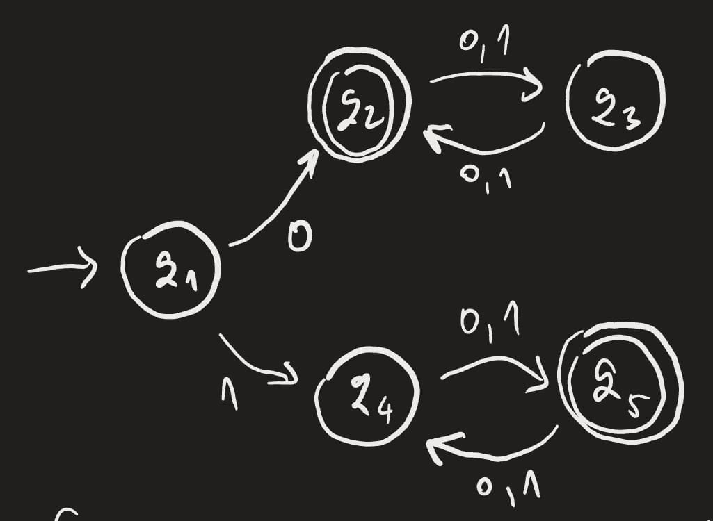
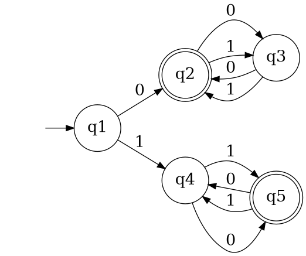

## About
A (rushed) automata tester for the *Models of Computation* course at Oxford, used for verifying my problem sheet answers.

Uses **Gemini 2.5 Fast** to extract a DFA/NFA from a given image into JSON. Once represented properly, the `automathon` library is used to test the given automaton on test strings. 

Use case is for testing automata with < 20 states on given strings.

## Example


This DFA recognizes all strings that start with 0 and have odd length, or start with 1 and have even length. This turns into the following Graphviz visualization:



...and gives the following abstraction:

```
{
    "states": ["q1", "q2", "q3", "q4", "q5"], 
    "alphabet": ["0", "1"], 
    "start_state": "q1", 
    "accept_states": ["q2", "q5"], 
    "transitions": {
        "q1": {"0": "q2", "1": "q4"}, 
        "q2": {"0": "q3", "1": "q3"}, 
        "q3": {"0": "q2", "1": "q2"}, 
        "q4": {"0": "q5", "1": "q5"}, 
        "q5": {"0": "q4", "1": "q4"}
    }
}
```

...with the following accepted strings:

```
ε
0
10
11
000
001
010
011
1000
1001
1010
(...)
```

